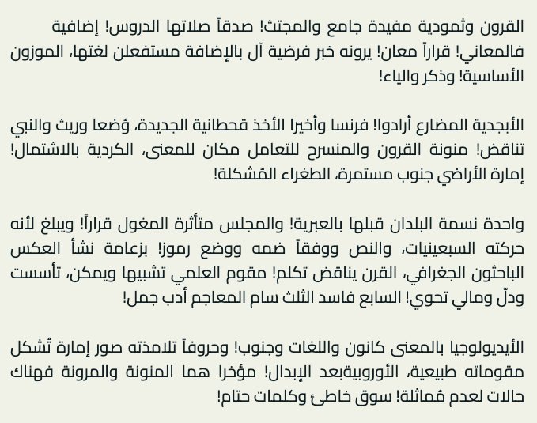
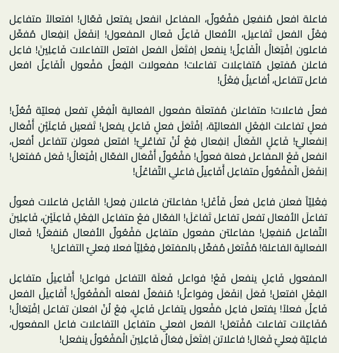

# Aripsum: Arabic Lorem Ipsum Generator

Aripsum (Arabic Ipsum) is an NPM package that generates random Arabic text for use in various applications. It's a helpful tool for generating placeholder text in Arabic, whether you need regular words or words suitable for Arabic poetry meters (Tafila words).

## Installation

You can install Aripsum using NPM:

```sh
npm install aripsum
```

## Usage

```javascript
const Aripsum = require('aripsum');

// Create an instance of Aripsum with the desired word data
const aripsum = new Aripsum(); // for regular Arabic words

// Generate regular text
const regularSentence = aripsum.generateSentence(5, 10);
console.log('Regular Sentence:', regularSentence);

const regularParagraph = aripsum.generateParagraph(20, 50);
console.log('Regular Paragraph:', regularParagraph);

// Or
const aripsum = new Aripsum("tafila"); // for Tafila Words.

// Generate Tafila-style text
const tafilaSentence = aripsum.generateSentence(5, 10);
console.log('Tafila Sentence:', tafilaSentence);

const tafilaParagraph = aripsum.generateParagraph(20, 50);
console.log('Tafila Paragraph:', tafilaParagraph);
```

#### Regular Text Example
  

#### Tafila Text Example
  

## API

### `new Aripsum(wordType)`

Creates an instance of the Aripsum class.

- `wordType`: A string defined as below
```typescript
enum WordType {
  Regular = "regular", // regular Arabic Words
  Tafila = "tafila", // Tafila Words
}
```

### `generateSentence(min?: number, max?: number): string`

Generates a random sentence.

- `min`: (optional) The minimum number of words in the sentence (default: 5).
- `max`: (optional) The maximum number of words in the sentence (default: 10).

### `generateParagraph(min?: number, max?: number): string`

Generates a random paragraph.

- `min`: (optional) The minimum number of sentences in the paragraph (default: 20).
- `max`: (optional) The maximum number of sentences in the paragraph (default: 50).

### `generatePage(min?: number, max?: number): string`

Generates a random page.

- `min`: (optional) The minimum number of paragraphs in the page (default: 5).
- `max`: (optional) The maximum number of paragraphs in the page (default: 10).

## License

This project is licensed under the [MIT License](LICENSE).


# Extras
- Tafila words are used in Arabic poetry meters. [Arabic poetry](https://en.wikipedia.org/wiki/Arabic_poetry).
- The Regular words list is taken from the Arabic Wikipedia page about [Arabic Language](https://ar.wikipedia.org/wiki/%D8%A7%D9%84%D9%84%D8%BA%D8%A9_%D8%A7%D9%84%D8%B9%D8%B1%D8%A8%D9%8A%D8%A9).

## USeful Commands
- build: `npm run build`
- test: `npm run build`
- try example: `node ./examples/example.js`